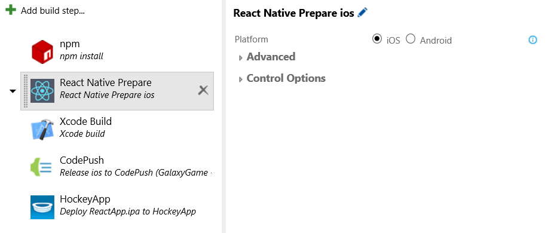

<table style="width: 100%; border-style: none;"><tr>
<td style="width: 140px; text-align: center;"></td>
<td><strong>Visual Studio Team Services Extension for React Native (Preview)</strong><br />
<i>Streamline CI setup for your React Native app using a set of useful pre-defined build steps.</i><br />
<a href="http://www.microsoft.com">Install now!</a>
</td>
</tr></table>
# Visual Studio Team Services Extension for React Native (Preview)
**This extension targets a platform (React Native) that is rapidly evolving and therefore this extension is currently in early preview. It has been designed for use with React Native _0.19.0_ and above.** Earlier versions of React Native are missing out-of-box support for selecting non-global versions of Node.js for iOS and therefore may not function as expected and may still result in a hung build for iOS.

[React Native](http://facebook.github.io/react-native/) is an exciting new technology that allows you to bring awesome native app experiences to Android and iOS using a consistent developer experience based on JavaScript and React. Visual Studio Team Services (formerly Visual Studio Online) and Team Foundation Services (TFS) 2015 can be used for building and testing React Native apps in a Continuous Integration (CI) environment thanks to a new [cross-platform agent](http://go.microsoft.com/fwlink/?LinkID=533789) that supports OSX. 

When you are developing your React Native app you'll be able to take advantage of the React Native packager but in a CI environment or for actual app deployments you'll want to create an offline "bundle" that present a few chanllenges that need to be resolved.

This extension provides a "React Native Prepare" task to simplify setup and deal with two specific problems: 

1. Node.js version headaches - The task will fetch and alter projects to use a compatible version of Node.js if not found globally installed.
2. Preventing the "Packager" from starting up as a server and hanging your native Xcode build for iOS.

Combined with a "Bundle" task it should provide you with all the tools you need to get your React Native App up and running in a CI environment.



## Quick Start

1. After installing the extension, upload your project to VSTS, TFS, or GitHub.

2. Go to your VSTS or TFS project, click on the **Build** tab, and create a new build definition (the "+" icon). You can use the Empty template.

3. Click **Add build step...** and add the following to your build definition:
   
   1. Add **npm** from the **Package** category. Specify **--no-optional --only=prod** under Advanced > Arguments to speed up the build. You may need to add **--force** if you encounter EPERM issues in the Hosted VSTS agent due to a [npm issue](https://github.com/npm/npm/issues/9696).
   2. Add **React Native Prepare** from the **Build** category.
needed for upgraded projects.)
   4. Add **Xcode Build** for iOS or **Gradle** for Android from the **Build** category.

4. **[Optional]** While typically not required recent React Native 0.19.0 and up, you can also add **React Native Bundle** from the **Build** category to create your offline bundle.

5. Configure the the build steps as appropriate for your project - *Check out the tool tips for handy inline documentation.*

In addition, be sure you are running version **0.3.10** or higher of the cross-platform agent and the latest Windows agent as these are required for VS Team Services extension to function. The VSTS hosted agent and [MacinCloud](http://go.microsoft.com/fwlink/?LinkID=691834) agents will already be on this version.

**Windows Agent Notes:** 
- **curl** also needs to be in the path on Windows if Node.js < 4.0.0 is globally installed. You can get curl by installing the [Git Command Line Tools](http://www.git-scm.com/downloads).

##Additional Task Details
###React Native Prepare
The React Native Prepare task has two primary functions. *Note that if you are running into problems have deviated from the default project provided by React Native init using 0.19.0 or above you may need to make some tweaks.* The task is designed to do the following:

1. Acquire an appropriate version of Node.js if not found on the system and then modifies your project to use the specified version when bundling. This is particularly useful in environments you may not control. 
2. Disable the React Native Packager from starting when building iOS which will hang the build and can result in port conflicts when more than one agent is on a given piece of hardware.

Under the hood, here is what is happening:

1. **Android**: It modifies **react.gradle** to call node node_modules/react-native/local-cli/cli.js using the correct version of Node.js instead of just blindly calling "react-native bundle".
2. **iOS**: For iOS, two changes were required:
    1. It modifies your the **Bundle React Native code and images** Build Phase in your Xcode project ensure **export NODE_BINARY** is set to the correct path to Node.js as an environment variable before calling ../node_modules/react-native/packager/react-native-xcode.sh. If the export is missing it is added.
    2. It disables the startup of the React Native Packager as a local server in the Build Phases of **node_modules/react-native/React.xcodeproj** by modifying the embedded shell script to exit as this provides no value in a CI workflow and will hang the agent.

###React Native Bundle
This task is a thin UI layer on top of the standard React Native bundle command from the React Native CLI. It is provided as a convienence mechanism and is not required when using stock projects for 0.19.0 and up as the provided Gradle build and Xcode projects trigger bundling when doing a release build by default.

##Installation

### Visual Studio Team Services / Visual Studio Online
1. Install the [Visual Studio Team Services Extension for React Native](http://www.microsoft.com)

2. You will now find the React Native Prepare task in the "Build" category 

### TFS 2015 Update 1 or Earlier

1. [Enable basic auth](http://go.microsoft.com/fwlink/?LinkID=699518) in your TFS instance

2. Install the tfx-cli and login. If you already have the tfx-cli installed, be sure it is **0.3.6 or higher.**

	~~~~~~~~~~~~~~~~~~~~~~~~~~~~~~~~~~
	npm install -g tfx-cli
	tfx login --auth-type basic 
	~~~~~~~~~~~~~~~~~~~~~~~~~~~~~~~~~~

3. Enter your collection URL (Ex: https://localhost:8080/tfs/DefaultCollection) and user name and password. Do not include a slash (/) at the end of the collection URL.

4. Download the [latest release](https://github.com/Microsoft/vsts-react-native-tasks/releases) of the React Native tasks locally and unzip

5. Type the following from the root of the repo from Windows:

	~~~~~~~~~~~~~~~~~~~~~~~~~~~~~~~~~~
	upload
	~~~~~~~~~~~~~~~~~~~~~~~~~~~~~~~~~~

	Or from a Mac:

	~~~~~~~~~~~~~~~~~~~~~~~~~~~~~~~~~~
	sh upload.sh
	~~~~~~~~~~~~~~~~~~~~~~~~~~~~~~~~~~

5. Profit!

## Terms of Use
By downloading and running this project, you agree to the license terms of the third party application software, Microsoft products, and components to be installed. 

The third party software and products are provided to you by third parties. You are responsible for reading and accepting the relevant license terms for all software that will be installed. Microsoft grants you no rights to third party software.

## License

```
The MIT License (MIT)

Copyright (c) Microsoft Corporation

Permission is hereby granted, free of charge, to any person obtaining a copy
of this software and associated documentation files (the "Software"), to deal
in the Software without restriction, including without limitation the rights
to use, copy, modify, merge, publish, distribute, sublicense, and/or sell
copies of the Software, and to permit persons to whom the Software is
furnished to do so, subject to the following conditions:

The above copyright notice and this permission notice shall be included in all
copies or substantial portions of the Software.

THE SOFTWARE IS PROVIDED "AS IS", WITHOUT WARRANTY OF ANY KIND, EXPRESS OR
IMPLIED, INCLUDING BUT NOT LIMITED TO THE WARRANTIES OF MERCHANTABILITY,
FITNESS FOR A PARTICULAR PURPOSE AND NONINFRINGEMENT. IN NO EVENT SHALL THE
AUTHORS OR COPYRIGHT HOLDERS BE LIABLE FOR ANY CLAIM, DAMAGES OR OTHER
LIABILITY, WHETHER IN AN ACTION OF CONTRACT, TORT OR OTHERWISE, ARISING FROM,
OUT OF OR IN CONNECTION WITH THE SOFTWARE OR THE USE OR OTHER DEALINGS IN THE
SOFTWARE.
```
